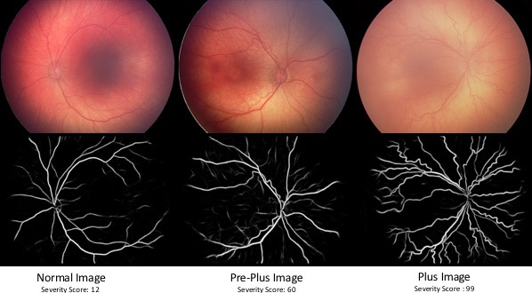

# IROP-ASSIST-Package


***


## Example Images and Results
We proccessed one image from each class (Normal, Pre-Plus, Plus) as an example of our system. In this folder, you can find raw images, their segmentations, features and scores. All these files can be regenerated by running the following line. 

```
python mainScript.py "example/" "exampleImages.xlsx" "scoresOfExampleImages.xlsx" 
```
Note that features are generated using the segmented images located  under "Segmentated/SegmentationsFromBrownetal".

For details about the segmentation modules please have a look at the following links.
-- [Oribix retina-unet](https://github.com/orobix/retina-unet.git)
-- [Fully automated disease severity assessment and treatment monitoring in retinopathy of prematurity using deep learning](https://doi.org/10.1117/12.2295942)  

